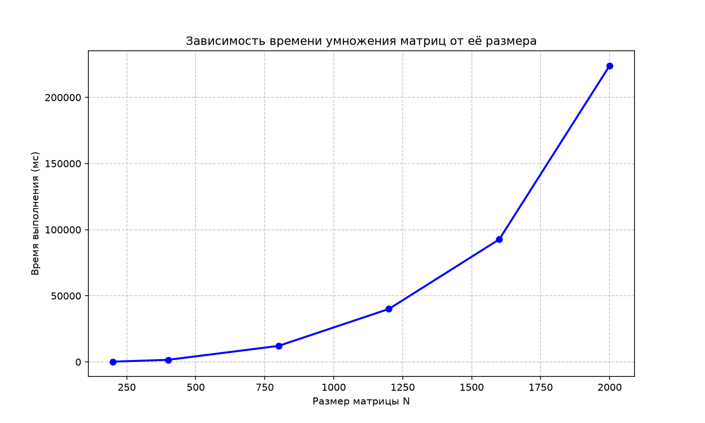

# Лабораторная работа №1
## Перемножение квадратных матриц

**Студент:** Дарья Скирдова  
**Группа:** 6213-100503D

## 1. Цель работы

Изучение алгоритма перемножения квадратных матриц, реализация его на языке C++ и анализ временной сложности алгоритма.

## 2. Постановка задачи

- **Входные данные:** две квадратные матрицы размера N×N, хранящиеся в текстовых файлах `matrix1.txt` и `matrix2.txt`.
- **Выходные данные:** результат перемножения матриц, записанный в файл `result.txt`, а также время выполнения операции умножения.
- **Верификация:** правильность результатов проверяется с помощью библиотеки NumPy (Python).

## 3. Структура проекта
```
paral_prog/          
├── CMakeLists.txt   
├── lab1/               
│   ├── lab1.cpp
│   ├── generate.py
│   ├── verify.py
│   ├── measure.py
│   ├── CMakeLists.txt  
│   ├── plot.py
│   ├── .gitignor
│   ├── README.md    
│   ├── matrix1.txt
│   ├── matrix2.txt
│   ├── result.txt
│   ├── timings.txt
│   └── graph.png
└── out/                    
```
CMakeLists.txt — конфигурация сборки CMake
lab1.cpp — исходный код программы на C++
generate.py — генератор случайных матриц
verify.py — верификация результата через NumPy
measure.py — замер времени для разных размеров
plot.py — построение графика зависимости
README.md — отчёт
timings.txt — таблица результатов замеров
graph.png — график зависимости времени от размера

## 4. Верификация

Правильность работы программы проверена сравнением с результатом,
полученным через библиотеку NumPy (Python).

Результат проверки:
ПРОВЕРКА ПРОЙДЕНА
Максимальная погрешность: 0.0000000000
Сравнение с NumPy: результаты совпадают

Максимальная погрешность равна нулю — это значит, что алгоритм C++
даёт точный результат, полностью совпадающий с эталонным вычислением
через NumPy.

## 5. Результаты экспериментов 

| Размер N | Среднее время (мс) |
|----------|--------------------|
| 200      | 190.00             |
| 400      | 1589.00            |
| 800      | 12106.33           |
| 1200     | 40038.67           |
| 1600     | 92677.00           |
| 2000     | 224043.67          |

## 6. График зависимости времени от размера



## 7. Выводы

В ходе работы реализован алгоритм перемножения квадратных матриц на C++ 
со сложностью **O(N³)**, а также проведены эксперименты для размеров 
от 200 до 2000.

Результаты показывают, что время выполнения растёт нелинейно: при 
увеличении размера матрицы в 2 раза время увеличивается примерно 
в 8 раз, что подтверждает кубическую сложность алгоритма.

Верификация через NumPy показала полное совпадение результатов 
(погрешность 0.0000000000).

При N=2000 время выполнения становится значительным, что говорит 
о необходимости оптимизации или распараллеливания для больших задач.

