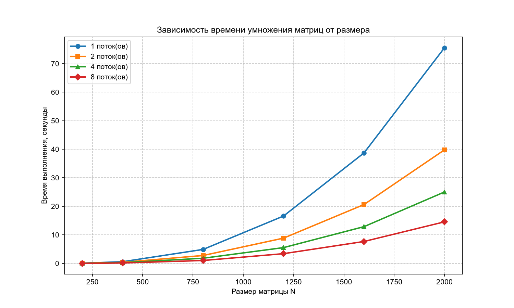
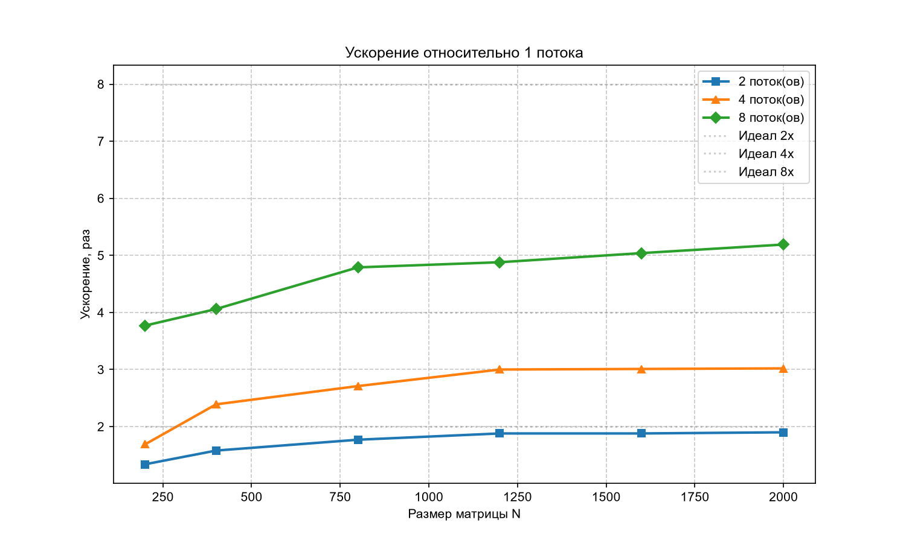

# Лабораторная работа №2
## Параллельное умножение матриц с использованием OpenMP

**Студент:** Дарья Скирдова  
**Группа:** 6213-100503D


## 1. Цель работы

Модифицировать программу умножения квадратных матриц из лабораторной работы №1 для параллельной работы по технологии OpenMP. Провести серию экспериментов с разным количеством потоков и разными размерами матриц, оценить ускорение относительно последовательной версии.

## 2. Постановка задачи

Дано: программа умножения матриц из л/р №1.

Требуется:
- распараллелить умножение с помощью OpenMP;
- провести эксперименты для размеров 200, 400, 800, 1200, 1600, 2000 
  и потоков 1, 2, 4, 8;
- построить таблицы и графики зависимости времени и ускорения;
- проверить корректность параллельной версии.

## 3. Реализация

В программе реализованы две функции умножения матриц:

### Последовательная версия

```cpp
vector<vector<double>> mulSeq(const vector<vector<double>>& A,
                              const vector<vector<double>>& B,
                              int n) {
    vector<vector<double>> C(n, vector<double>(n, 0.0));
    for (int i = 0; i < n; ++i) {
        for (int k = 0; k < n; ++k) {
            double aik = A[i][k];
            for (int j = 0; j < n; ++j) {
                C[i][j] += aik * B[k][j];
            }
        }
    }
    return C;
}
```

### Параллельная версия (OpenMP)

```cpp
vector<vector<double>> mulOmp(const vector<vector<double>>& A,
                              const vector<vector<double>>& B,
                              int n) {
    vector<vector<double>> C(n, vector<double>(n, 0.0));

    #pragma omp parallel for schedule(static)
    for (int i = 0; i < n; ++i) {
        for (int k = 0; k < n; ++k) {
            double aik = A[i][k];
            for (int j = 0; j < n; ++j) {
                C[i][j] += aik * B[k][j];
            }
        }
    }
    return C;
}
```

## 4. Результаты экспериментов

### Условия проведения

- Процессор: 8 физических ядер (16 логических процессоров с гипертредингом)
- Версия OpenMP: 200203
- Конфигурация сборки: Debug
- Размеры матриц: 200, 400, 800, 1200, 1600, 2000
- Количество потоков: 1, 2, 4, 8

Для каждой комбинации «размер × потоки» программа запускалась 
один раз. Замерялось время только самого умножения матриц — 
без учёта генерации и вывода.

### 4.1. Время выполнения, секунды

| Размер N | 1 поток | 2 потока | 4 потока | 8 потоков |
|----------|---------|----------|----------|-----------|
| 200      | 0.0744  | 0.0555   | 0.0441   | 0.0198    |
| 400      | 0.5941  | 0.3767   | 0.2486   | 0.1463    |
| 800      | 4.8927  | 2.7648   | 1.8047   | 1.0207    |
| 1200     | 16.6004 | 8.8512   | 5.5365   | 3.4039    |
| 1600     | 38.7176 | 20.6267  | 12.8766  | 7.6790    |
| 2000     | 75.5686 | 39.7909  | 25.0291  | 14.5637   |

### 4.2. Ускорение относительно одного потока

Ускорение показывает, во сколько раз программа работает быстрее 
при N потоках, чем при одном:

| Размер N | 1 поток | 2 потока | 4 потока | 8 потоков |
|----------|---------|----------|----------|-----------|
| 200      | 1.00    | 1.34     | 1.69     | 3.77      |
| 400      | 1.00    | 1.58     | 2.39     | 4.06      |
| 800      | 1.00    | 1.77     | 2.71     | 4.79      |
| 1200     | 1.00    | 1.88     | 3.00     | 4.88      |
| 1600     | 1.00    | 1.88     | 3.01     | 5.04      |
| 2000     | 1.00    | 1.90     | 3.02     | 5.19      |

### 4.3. Производительность, GFLOPS

| Размер N | 1 поток | 2 потока | 4 потока | 8 потоков |
|----------|---------|----------|----------|-----------|
| 200      | 0.205   | 0.326    | 0.438    | 0.475     |
| 400      | 0.206   | 0.410    | 0.507    | 0.897     |
| 800      | 0.209   | 0.397    | 0.707    | 1.029     |
| 1200     | 0.205   | 0.405    | 0.736    | 1.078     |
| 1600     | 0.210   | 0.407    | 0.710    | 1.078     |
| 2000     | 0.212   | 0.399    | 0.691    | 1.136     |

## 5. Графики

### 5.1. Зависимость времени от размера матрицы



### 5.2. Ускорение относительно одного потока



## 6. Выводы

Программа умножения матриц успешно распараллелена с помощью OpenMP.

Параллельная версия даёт результат, полностью совпадающий 
с последовательной — максимальное отклонение равно нулю.

С ростом числа потоков время выполнения уменьшается: 2 потока 
дают ускорение ~1.9×, 4 потока — ~3.0×, 8 потоков — до 5.2×. 
Ускорение не линейное из-за накладных расходов OpenMP, конкуренции 
за память и использования гипертрединга.

Наибольший эффект достигается на больших матрицах (N ≥ 800). 
Для дальнейшего ускорения можно применить блочное умножение 
или распараллеливание на GPU.